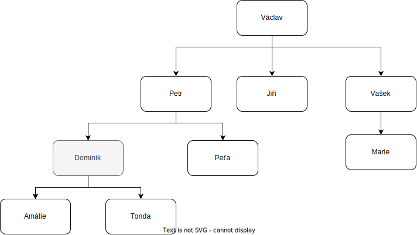

# Family tree - simple coding

Your task is to create simple script for family tree.

Requirements:
1) create a typescript type for this family tree
   - each person has `name` and `children`
2) create a simple data sample (your own family or random names)
    - for simplicity, there are no duplicates in `names`
3) create function which accepts parameter `name`and returns all the ancestors, for example: 
     - for parameter `Dominik`, it will return `Petr, Václav`
     - for parameter `Amálie`, it will return `Dominik, Petr, Václav`

